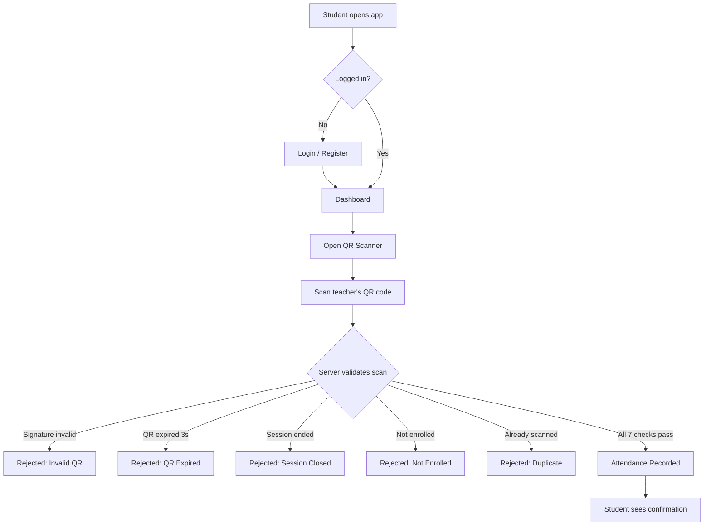
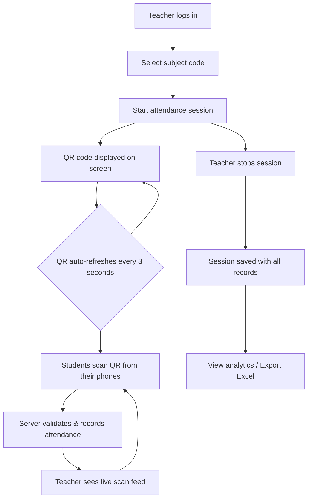
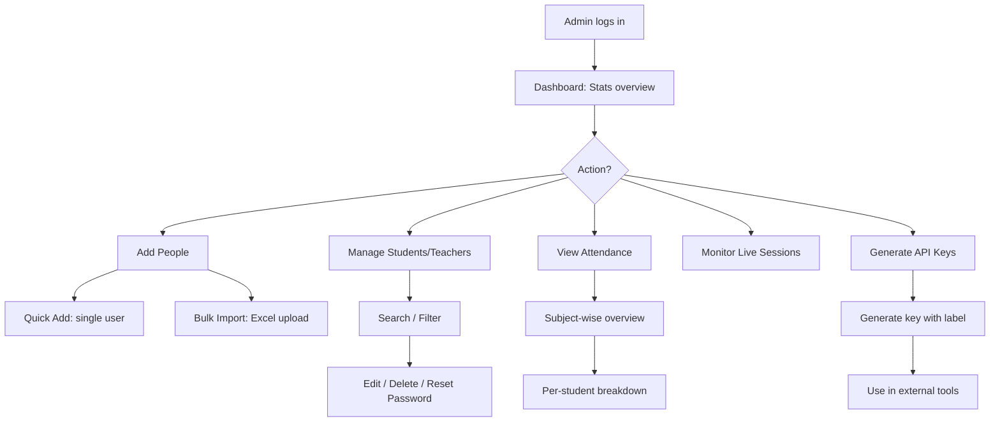
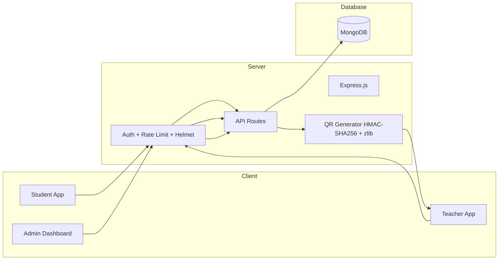

<div align="center">

# ScanMark

### Smart QR-Based Attendance System

**Fast. Secure. Tamper-Proof.**

Built for universities and classrooms where attendance should take seconds, not minutes.

---

</div>

## The Problem

Roll calls waste **5-10 minutes** every lecture. Proxy attendance is rampant. Paper registers get lost. Spreadsheets are error-prone. Faculty spend hours compiling attendance reports manually.

## The Solution

**ScanMark** — a real-time QR code attendance system where teachers generate a cryptographically signed, auto-refreshing QR code that students scan from their phones. Attendance is recorded instantly, securely, and without any manual work.

- Teacher starts a session &rarr; QR code appears on screen
- Students scan with their phone &rarr; marked present in real-time
- QR code **refreshes every 3 seconds** &rarr; no screenshots, no sharing
- Done. No roll calls. No paper. No proxy.

---

## Features

### Student Side

| Feature                     | Description                                                             |
| --------------------------- | ----------------------------------------------------------------------- |
| **One-Tap Registration**    | Pre-seeded student data — just enter email and set a password           |
| **QR Scanner**              | Built-in camera scanner — scan the teacher's QR code to mark attendance |
| **Live Attendance Status**  | Instant confirmation after scanning                                     |
| **Subject-Wise Attendance** | View attendance percentage per subject with session history             |
| **Attendance History**      | Chronological log of all past attendance records                        |
| **Profile Management**      | Update year, subject codes, and change password                         |
| **Recovery Codes**          | 8 one-time-use recovery codes for password reset without email          |

### Teacher Side

| Feature                     | Description                                                             |
| --------------------------- | ----------------------------------------------------------------------- |
| **One-Click Session Start** | Select a subject &rarr; hit start &rarr; QR code is live                |
| **Auto-Refreshing QR**      | Cryptographically signed QR codes that rotate every 3 seconds           |
| **Live Scan Feed**          | Watch students get marked present in real-time as they scan             |
| **Session Management**      | Start, stop, and review attendance sessions                             |
| **Analytics Dashboard**     | Per-subject attendance summaries with student-wise breakdown            |
| **Attendance Grid**         | Full students &times; sessions matrix — click any cell to toggle P/A    |
| **Manual Corrections**      | Bulk-edit attendance with unsaved change tracking and one-click save    |
| **Session History**         | Paginated session list with date filtering and delete capability        |
| **Excel Export**            | Export styled attendance reports as `.xlsx` with formatting and filters |
| **Profile Management**      | Update professor type and change password                               |

### Admin Side

| Feature                   | Description                                                                   |
| ------------------------- | ----------------------------------------------------------------------------- |
| **Dashboard Overview**    | Total students, teachers, subjects, sessions at a glance                      |
| **Quick Add**             | Add individual students or teachers with a simple form                        |
| **Bulk Import**           | Drag-and-drop Excel upload — import hundreds of users at once                 |
| **Student Management**    | Search, filter, edit, delete, reset passwords, view/regenerate recovery codes |
| **Teacher Management**    | Same full CRUD capabilities as student management                             |
| **Attendance Overview**   | System-wide attendance percentages per subject with student-level drill-down  |
| **Live Sessions Monitor** | Watch all currently active sessions across the institution                    |
| **Recent Activity Feed**  | Interleaved timeline of sessions and registrations with date filtering        |
| **API Key Management**    | Generate, list, and revoke API keys for external integrations                 |
| **URL Builder**           | Build ready-to-use API URLs for tools like Power Automate or Google Sheets    |

---

## Security

ScanMark is built with security as a first-class concern. Every layer is hardened.

### QR Code Security — 6-Layer Tamper-Proof Pipeline

```
QR Payload = version | sessionId | teacherId | subjectCode | timestamp | nonce
                                      |
                              HMAC-SHA256 Signed
                                      |
                              zlib Compressed
                                      |
                              Base64 Encoded
                                      |
                         Rendered as QR Code Image
```

- **HMAC-SHA256 Signature** — Every QR payload is signed with a server secret. Forged QR codes are instantly rejected.
- **3-Second Expiry** — QR tokens are valid for only 3 seconds. Screenshots and shared images become useless almost immediately.
- **Random Nonce** — Each QR code includes a cryptographic nonce preventing replay attacks.
- **Server-Side Validation** — QR decoding, signature verification, and freshness checks all happen on the server. Nothing is trusted from the client.

### Scan Validation — 7-Step Pipeline

Every scan request passes through **7 sequential checks** before attendance is recorded:

| Step | Check                                                     |
| ---- | --------------------------------------------------------- |
| 1    | Decode and decompress the QR payload                      |
| 2    | Validate payload structure and version                    |
| 3    | Verify HMAC-SHA256 signature (tamper detection)           |
| 4    | Verify the attendance session is still active             |
| 5    | Verify the student is enrolled in the subject             |
| 6    | Prevent duplicate attendance (same student, same session) |
| 7    | Record attendance                                         |

If **any** step fails, the request is rejected with a specific error message. There is no partial state.

### Application Security

| Layer                 | Implementation                                                                   |
| --------------------- | -------------------------------------------------------------------------------- |
| **Authentication**    | JWT tokens with 24h expiry (7d for admin)                                        |
| **Password Hashing**  | bcrypt with 12 salt rounds                                                       |
| **Role-Based Access** | Middleware enforces `student`, `teacher`, `admin` roles on every protected route |
| **Rate Limiting**     | 2,000 scans/sec, 500 logins/sec, 5,000 general req/sec per IP                    |
| **HTTP Headers**      | Helmet.js with strict Content Security Policy                                    |
| **CORS**              | Configured with credentials support                                              |
| **Input Validation**  | express-validator on all user inputs                                             |
| **Body Size Limits**  | 10KB global JSON limit (prevents payload attacks)                                |
| **Recovery Codes**    | 8 UUID-based one-time codes for password recovery without email                  |

---

## Workflow

### Student Attendance Flow



### Teacher Session Flow



### Admin Management Flow



### System Architecture



---

## External API

Access attendance data programmatically using API keys.

```
GET /api/attendance/:subjectCode/:date/:periodNumber?apikey={YOUR_API_KEY}
```

| Parameter      | Format     | Example             |
| -------------- | ---------- | ------------------- |
| `subjectCode`  | String     | `CS1204`            |
| `date`         | DD-MM-YYYY | `13-03-2026`        |
| `periodNumber` | Integer    | `1`                 |
| `apikey`       | UUID       | `a1b2c3d4-e5f6-...` |

**Response:**

```json
{
  "success": true,
  "subjectCode": "CS1204",
  "date": "13-03-2026",
  "periodNumber": 1,
  "totalEnrolled": 60,
  "totalPresent": 54,
  "totalAbsent": 6,
  "students": [
    {
      "name": "John Doe",
      "rollNumber": "CS21B001",
      "email": "john@student.nitw.ac.in",
      "present": true
    }
  ]
}
```

No valid API key? **403 Access Forbidden.**

Integrate with Power Automate, Google Sheets, custom dashboards, or any tool that speaks HTTP.

---

## Tech Stack

| Layer              | Technology                                                    |
| ------------------ | ------------------------------------------------------------- |
| **Backend**        | Node.js, Express.js                                           |
| **Database**       | MongoDB with Mongoose ODM                                     |
| **Authentication** | JWT + bcrypt                                                  |
| **QR Engine**      | HMAC-SHA256 signed, zlib compressed, 3-second rotating tokens |
| **Security**       | Helmet, CORS, express-rate-limit, express-validator           |
| **Frontend**       | Vanilla HTML/CSS/JS — zero framework bloat                    |
| **Excel**          | SheetJS (client-side parsing + styled export)                 |

---

## Quick Start

```bash
# Clone the repository
git clone https://github.com/your-repo/scanmark.git
cd scanmark

# Install dependencies
npm install

# Configure environment
cp .env.example .env
# Edit .env with your MongoDB URI and JWT secret

# Start the server
npm run dev
```

The app will be running at `http://localhost:3000`

---

<div align="center">

### Designed & Developed by GSSV

</div>
